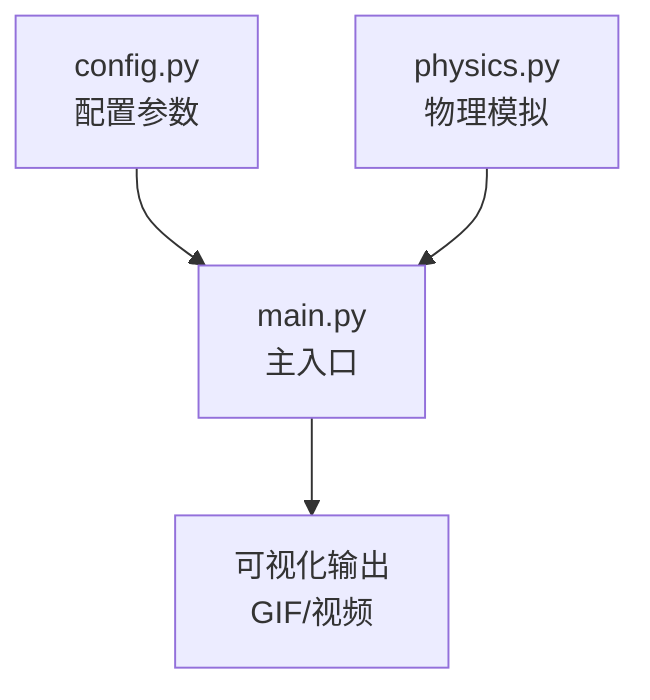

# CG-Lab/src项目介绍
#### 一、文件夹架构
| 文件/目录 | 功能说明 |
| --- | --- |
| `__init__.py` | 标识该文件夹为 Python 包，可包含包的初始化逻辑（如导出核心函数/类） |
| `config.py` | 配置文件：定义实验参数（如物理模拟的系数、图形渲染参数、路径配置等） |
| `physics.py` | 物理逻辑层：实现计算机图形学相关的物理模拟算法（如运动学、碰撞检测、力学计算等） |
| `main.py` | 主程序入口：整合配置、调用物理层逻辑，驱动图形渲染/模拟流程的执行 |
| `LxpokfxF_converted.gif` | 演示效果动图：直观展示该模块实现的图形学效果（如动画、物理模拟过程） |
| `演示视频.mp4` | 完整演示视频：比 GIF 更详细地展示功能运行过程 |
| `__pycache__/` | Python 编译后的字节码缓存目录，自动生成，用于加速代码运行 |

#### 二、代码逻辑
整体遵循「配置-逻辑-入口」的分层设计，核心执行流程：

1. **配置加载**：`main.py` 首先导入 `config.py` 中的参数（如模拟步长、渲染窗口大小、物理常量等）；
2. **物理计算**：`main.py` 调用 `physics.py` 中封装的核心函数（如物体运动轨迹计算、力的模拟、碰撞响应等）；
3. **效果输出**：物理计算结果驱动图形渲染/动画生成，最终通过 GIF呈现可视化效果。

简单逻辑流程图：

#### 三、实现功能
该模块核心是**计算机图形学方向的物理模拟可视化**，结合代码文件职责和演示文件（GIF/视频）推测具体功能：

1. 基于自定义物理规则（如刚体运动、粒子系统、简单力学模型）的图形动画模拟；
2. 通过 `config.py` 可灵活调整模拟参数（如重力系数、物体速度、渲染帧率等）；
3. 最终输出可视化的 GIF/视频，直观展示物理模拟的效果（如物体运动、碰撞、轨迹变化等）。

#### 四、可视化素材
<!-- 这是一张图片，ocr 内容为： -->

