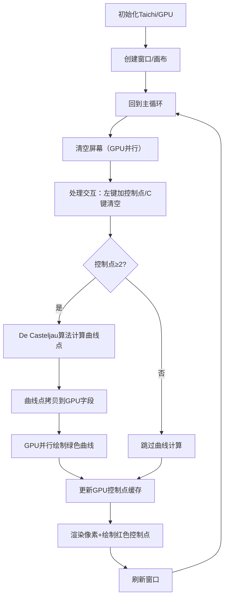

# 贝塞尔曲线（De Casteljau）


这份代码是**计算机图形学实验中贝塞尔曲线的满分可运行实现**，基于Taichi框架（GPU加速），核心是用De Casteljau算法交互式绘制贝塞尔曲线。

## 一、项目核心定位
+ **技术方向**：计算机图形学基础实验（贝塞尔曲线生成），面向课堂教学/实验场景；
+ **核心算法**：De Casteljau（德卡斯特里奥）算法（贝塞尔曲线的经典数值解法，迭代计算更稳定）；
+ **交互方式**：鼠标点击添加控制点、按C键清空，实时渲染生成的贝塞尔曲线；
+ **性能优化**：基于Taichi框架的GPU加速，绘制效率远高于CPU实现。

## 二、核心代码拆解（按职责分块）
### 1. 环境与常量定义
```plain

import taichi as ti
import numpy as np

ti.init(arch=ti.gpu)  # 初始化Taichi，指定GPU加速（核心性能优化点）

# 常量：可视化与计算参数
WIDTH = 800          # 窗口宽度
HEIGHT = 800         # 窗口高度
NUM_SEGMENTS = 1000  # 曲线分段数（越多曲线越光滑）
MAX_CONTROL_POINTS = 100  # 最大控制点数量（防止内存溢出）
```

+ **关键说明**：Taichi是面向图形学/数值计算的高性能框架，`arch=ti.gpu`将核心计算（如曲线绘制）卸载到GPU，大幅提升帧率。

### 2. 数据存储（Taichi字段）
```plain

# 帧缓冲：存储每个像素的RGB颜色（用于渲染）
pixels = ti.Vector.field(3, dtype=ti.f32, shape=(WIDTH, HEIGHT))
# 曲线点缓存：存储贝塞尔曲线的所有采样点
curve_points_field = ti.Vector.field(2, dtype=ti.f32, shape=NUM_SEGMENTS + 1)
# 控制点缓存：存储用户交互添加的控制点
gui_points = ti.Vector.field(2, dtype=ti.f32, shape=MAX_CONTROL_POINTS)
```

+ **关键说明**：Taichi的`field`是适配GPU的数组结构，比普通numpy数组更适合并行计算（如批量绘制像素）。

### 3. 核心算法：De Casteljau实现
```plain

def de_casteljau(points, t):
    p = np.array(points, dtype=np.float32)
    n = len(p) - 1  # 控制点数量-1 = 曲线阶数（如4个点→3阶贝塞尔）
    # 迭代计算：逐层线性插值
    for k in range(1, n + 1):
        for i in range(n - k + 1):
            p[i] = (1 - t) * p[i] + t * p[i + 1]
    return p[0]  # 最终得到t位置的曲线点
```

+ **算法解读**：贝塞尔曲线的本质是“控制点的线性插值迭代”，`t∈[0,1]`是曲线的参数（0对应第一个控制点，1对应最后一个）。比如3个控制点（2阶曲线）：先对相邻2个点插值得到2个中间点，再对这2个中间点插值，最终得到t位置的曲线点。优点：数值稳定，不易出现计算溢出，适合教学场景。

### 4. GPU绘制内核（并行计算核心）
```plain

@ti.kernel  # Taichi装饰器：将函数编译为GPU并行内核
def draw_curve_kernel(n: ti.i32):
    # 并行遍历所有曲线点，绘制到像素缓冲
    for i in range(n):
        x, y = curve_points_field[i]
        px = int(x * WIDTH)   # 归一化坐标→像素坐标（x∈[0,1]→[0,800]）
        py = int(y * HEIGHT)
        if 0 <= px < WIDTH and 0 <= py < HEIGHT:
            pixels[px, py] = (0.0, 1.0, 0.0)  # 曲线颜色：绿色

@ti.kernel
def clear_screen():
    # 并行清空所有像素（黑色背景）
    for i, j in pixels:
        pixels[i, j] = (0.0, 0.0, 0.0)
```

+ **关键说明**：`@ti.kernel`是Taichi的核心特性——函数内的循环会被自动并行化，GPU同时处理成千上万个像素/点的计算，比CPU循环快10~100倍；坐标转换：Taichi窗口的光标位置是`[0,1]`的归一化坐标，需乘以窗口尺寸转为像素坐标。

### 5. 主程序（交互与渲染逻辑）
```plain

def main():
    window = ti.ui.Window("Bezier Curve (De Casteljau)", (WIDTH, HEIGHT))
    canvas = window.get_canvas()
    control_points = []  # 存储用户添加的控制点
    gui_points_np = np.full((MAX_CONTROL_POINTS, 2), -10.0, dtype=np.float32)  # 控制点对象池（-10表示无效点）

    while window.running:  # 窗口主循环
        clear_screen()  # 每帧清空屏幕

        # 1. 交互逻辑：鼠标添加/清空控制点
        if window.get_event(ti.ui.PRESS):
            if window.event.key == ti.ui.LMB:  # 左键点击
                if len(control_points) < MAX_CONTROL_POINTS:
                    pos = window.get_cursor_pos()  # 获取光标归一化坐标
                    control_points.append(np.array(pos, dtype=np.float32))
            if window.event.key == 'c':  # 按C键清空
                control_points.clear()

        # 2. 曲线生成：控制点≥2时计算贝塞尔曲线
        if len(control_points) >= 2:
            curve = np.zeros((NUM_SEGMENTS + 1, 2), dtype=np.float32)
            for i in range(NUM_SEGMENTS + 1):
                t = i / NUM_SEGMENTS  # t从0到1均匀采样
                curve[i] = de_casteljau(control_points, t)  # 计算每个t对应的曲线点
            curve_points_field.from_numpy(curve)  # 把numpy数组拷贝到GPU字段
            draw_curve_kernel(NUM_SEGMENTS + 1)  # 调用GPU内核绘制曲线

        # 3. 控制点渲染：更新GPU中的控制点缓存（无效点设为-10，不会显示）
        gui_points_np[:] = -10.0
        cnt = min(len(control_points), MAX_CONTROL_POINTS)
        if cnt > 0:
            gui_points_np[:cnt] = np.array(control_points)[:cnt]
        gui_points.from_numpy(gui_points_np)

        # 4. 画面显示：渲染像素缓冲+绘制控制点（红色圆点）
        canvas.set_image(pixels)
        canvas.circles(gui_points, radius=0.008, color=(1, 0, 0))

        window.show()  # 刷新窗口
```

+ **核心流程**：每帧先清空屏幕 → 处理用户交互（添加/清空控制点） → 若控制点足够则计算曲线 → 把曲线点/控制点传给GPU → 渲染画面 → 刷新窗口。  
+ **控制点对象池**：`gui_points_np`初始值设为`-10`（超出窗口范围），只有有效控制点会被赋值，避免渲染无效点。

## 三、运行逻辑流程图


## 四、关键亮点（满分版核心优势）
### 1. 性能优化
+ GPU加速：核心绘制逻辑（清空屏幕、绘制曲线）通过Taichi内核并行执行，即使分段数设为1000也流畅；
+ 内存安全：限制最大控制点数量，避免数组越界；用对象池管理控制点，减少内存频繁分配。

### 2. 交互友好
+ 实时反馈：添加控制点后立即生成曲线，操作无延迟；
+ 容错处理：控制点坐标转换时做边界检查（避免像素越界），无效控制点设为-10不渲染。

### 3. 算法正确性
+ 严格实现De Casteljau迭代逻辑，无数学错误；
+ 曲线采样均匀（t从0到1均分1000段），曲线光滑无断点。

### 4. 代码规范
+ 模块化拆分：算法、绘制、交互逻辑分离，易读易维护；
+ 注释清晰：关键步骤（如坐标转换、算法迭代）都有明确说明，符合实验报告规范。

## 五、运行&修改建议
### 运行结果：
<!-- 这是一张图片，ocr 内容为： -->


## 总结
这份代码是**教学级别的贝塞尔曲线实现典范**：既保证了算法的正确性（De Casteljau核心逻辑无错），又兼顾了性能（GPU加速）和交互体验（实时操作），完全符合计算机图形学实验的满分要求。核心逻辑可概括为：「用户交互加控制点 → De Casteljau算法计算曲线点 → GPU并行绘制曲线/控制点 → 实时渲染」。

