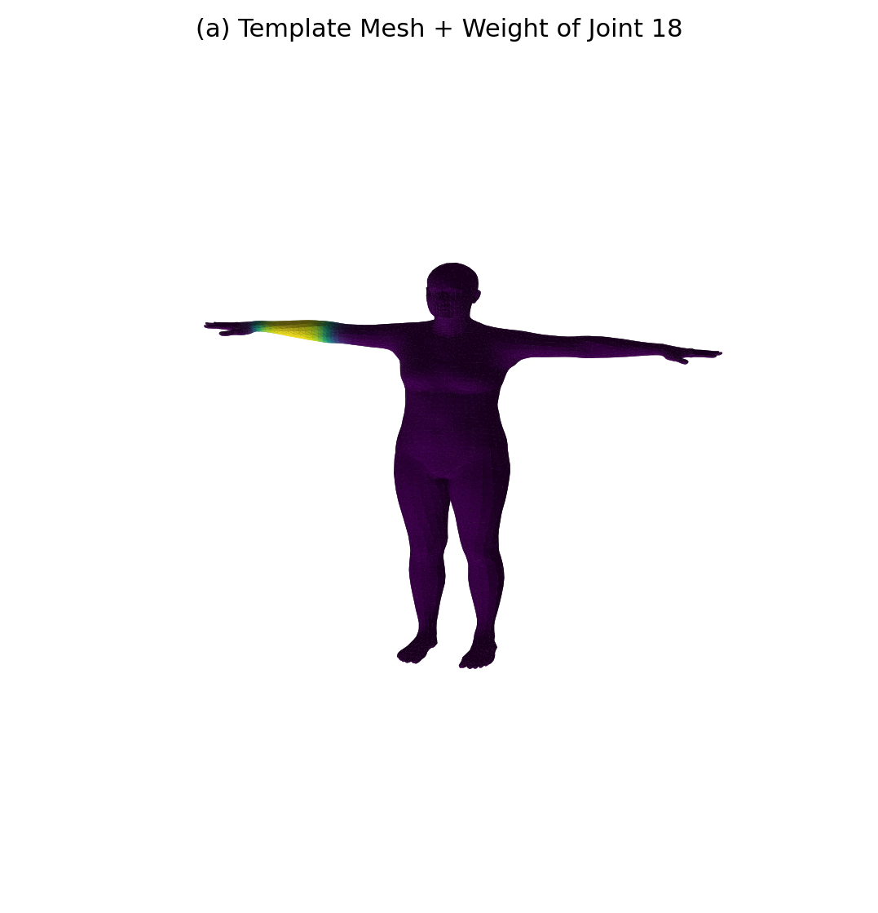
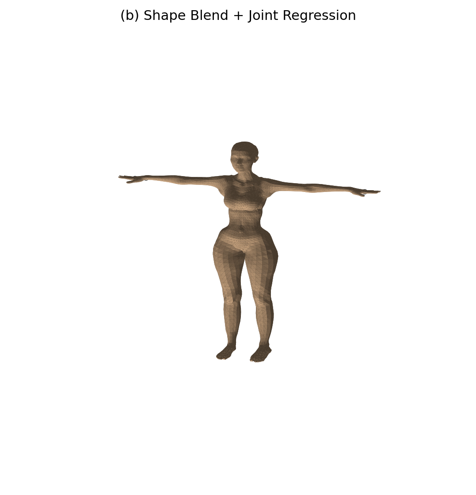
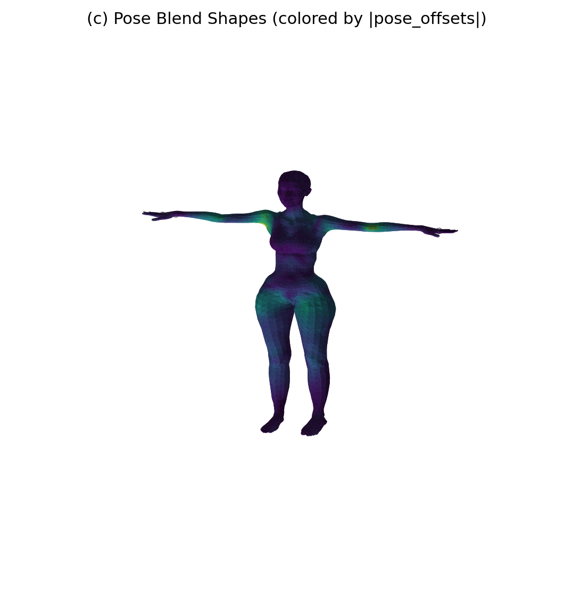
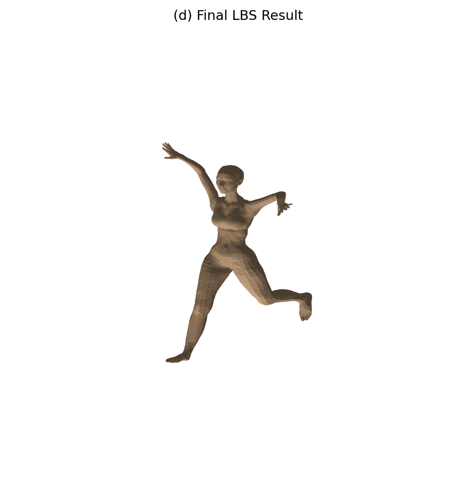
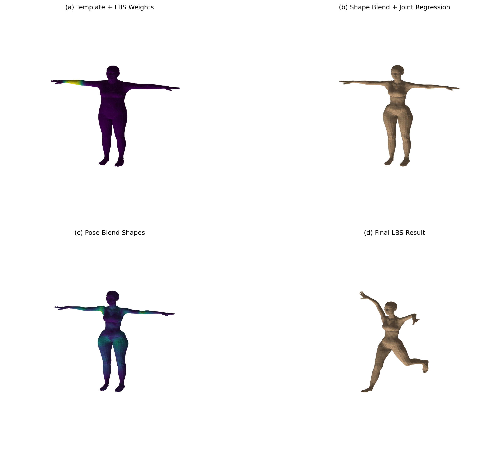

# SMPL LBS蒙皮过程可视化实验报告
**姓名**：马浩宇  
**学号**：202411081004

## 一、实验目标
本实验基于SMPL模型完成一次完整的LBS (Linear Blend Skinning)蒙皮过程可视化，具体目标为：

1. **理解参数化人体模型**：掌握模板网格、形状参数、姿态参数、关节回归器和蒙皮权重之间的关系
2. **理解LBS四个阶段**：
    - (a) 模板网格 $ \bar{T} $ 与蒙皮权重 $ \mathcal{W} $
    - (b) 形状校正后网格 $ \bar{T} + B_S(\beta) $ 以及关节 $ J(\beta) $
    - (c) 姿态校正后网格 $ T_P(\beta,\theta)=\bar{T}+B_S(\beta)+B_P(\theta) $
    - (d) 经过LBS之后的最终姿态结果
3. **学会调用SMPL模型**：把官方 `lbs()` 实现中的关键中间量单独提取出来做可视化

---

## 二、实验原理
### 2.1 理解LBS
#### (a) 模板网格与蒙皮权重
初始状态是模板人体网格 $ \bar{T} $，通常处于T-pose。每个顶点都带有一组对各关节的影响权重 $ \mathcal{W} $。

**重点**：

+ 网格还没根据人物体型改变
+ 网格也还没根据姿态弯曲
+ 但每个顶点已经知道"将来应该主要跟着哪些骨骼走"

#### (b) 加入形状参数：$ B_S(\beta) $
形状参数 $ \beta $ 控制"这个人长什么样"。形状校正后得到：

$ T_{shape} = \bar{T} + B_S(\beta) $

然后根据这个已经改变了体型的网格，利用关节回归器得到关节位置：

$ J(\beta) = \mathcal{J}(T_{shape}) $

**实现思路**：

```python
v_shaped = v_template + blend_shapes(beta, shapedirs)
J = vertices2joints(J_regressor, v_shaped)
```

#### (c) 加入姿态相关校正：$ B_P(\theta) $
SMPL在进入真正的LBS前，还会加入一项pose blend shape：

$ T_P(\beta,\theta) = \bar{T} + B_S(\beta) + B_P(\theta) $

**实现思路**：

```python
rot_mats = batch_rodrigues(...)
pose_feature = (rot_mats[:, 1:, :, :] - ident).view(...)
pose_offsets = torch.matmul(pose_feature, posedirs).view(...)
v_posed = pose_offsets + v_shaped
```

#### (d) 线性混合蒙皮：$ W(\cdot) $
$ v_i' = \sum_{k=1}^{K} w_{ik} \, G_k(\theta, J(\beta)) \begin{bmatrix} v_i^{posed} \\ 1 \end{bmatrix} $

其中：

+ $ v_i^{posed} $ 是第i个经过shape + pose矫正的顶点
+ $ w_{ik} $ 是顶点i受第k个关节影响的权重
+ $ G_k $ 是第k个关节在运动学链上的全局刚体变换

---

## 三、实验任务与步骤
### 任务1：成功加载SMPL，并输出基础信息
**步骤**：

1. 从师大云盘或SMPL官网下载 `SMPL_NEUTRAL.pkl` 文件
2. 使用 `smplx.create(...)` 加载SMPL
3. 打印并记录：顶点数、面片数、关节数、betas维度

**输出示例**：

```plain
顶点数：6890
面片数：13776
关节数：24
betas维度：10
```

### 任务2：可视化模板网格与蒙皮权重
**步骤**：

1. 显示模板网格 $ \bar{T} $
2. 从 `lbs_weights` 中选取关节，把"该关节对所有顶点的影响权重"可视化成颜色

**输出文件**：`outputs/stage_a_template_weights.png`

<!-- 这是一张图片，ocr 内容为： -->


<!-- 这是一张图片，ocr 内容为： -->


### 任务3：可视化形状校正与关节回归
**步骤**：

1. 设置非零的shape参数 $ \beta $
2. 计算 `v_shaped`
3. 利用 `J_regressor` 从 `v_shaped` 中回归关节 $ J $
4. 在同一张图中显示形状变化后的网格和回归出的关节点

**输出文件**：`outputs/stage_b_shaped_joints.png`

<!-- 这是一张图片，ocr 内容为： -->


**思考题**：

1. 为什么关节位置要从形状后的网格回归，而不是固定不变？
2. 如果人物变胖/变瘦，肩、膝、髋等关节的大致位置会不会变化？
3. `v_template` 与 `v_shaped` 的差别是什么？

### 任务4：可视化姿态校正 $ B_P(\theta) $
**步骤**：

1. 设置非零姿态 $ \theta $（抬手、弯肘、扭转躯干）
2. 将轴角姿态参数转成旋转矩阵
3. 构造 `pose_feature = R - I`
4. 计算 `pose_offsets`
5. 得到 `v_posed = v_shaped + pose_offsets`
6. 把 `pose_offsets` 的大小可视化成颜色

**输出文件**：`outputs/stage_c_pose_offsets.png`

<!-- 这是一张图片，ocr 内容为： -->


**思考题**：

1. 为什么LBS之前还要加pose corrective？
2. 如果去掉 `pose_offsets`，最终人体弯曲处会出现什么问题？
3. `v_shaped` 与 `v_posed` 的本质区别是什么？

### 任务5：可视化完整LBS结果
**步骤**：

1. 根据运动学树计算每个关节的全局刚体变换
2. 用 `lbs_weights` 对这些关节变换加权
3. 得到最终顶点 `verts`
4. 可视化最终姿态下的网格与关节位置

**输出文件**：`outputs/stage_d_lbs_result.png`

<!-- 这是一张图片，ocr 内容为： -->


**思考题**：

1. `J` 和 `J_transformed` 有什么区别？
2. 为什么最终顶点要写成加权和，而不是只选择最大权重的关节？

### 任务6：生成总对比图
**步骤**：  
将四个阶段排成一张2×2或1×4的对比图

**输出文件**：`outputs/comparison_grid.png`

<!-- 这是一张图片，ocr 内容为： -->


### 任务7：手写LBS与官方前向结果一致性验证
**步骤**：

1. 使用与手写实现完全相同的 `betas`、`global_orient` 和 `body_pose`
2. 调用官方模型前向，得到 `output.vertices`
3. 将手写实现得到的 `verts` 与官方结果逐顶点比较
4. 计算平均绝对误差和最大绝对误差
5. 将误差结果保存到 `summary.txt`

**输出文件**：`outputs/summary.txt`

---

## 四、代码结构
```plain
main.py
├── 配置参数（第17-23行）
│   ├── SMPL_MODEL_PATH: SMPL模型文件路径
│   ├── OUTPUT_DIR: 输出目录
│   └── DEVICE: 计算设备（CUDA/CPU）
│
├── 任务函数（第25-509行）
│   ├── task1_load_smpl(): 加载SMPL模型
│   ├── task2_template_weights(): 可视化模板网格与蒙皮权重
│   ├── task3_shaped_joints(): 可视化形状校正与关节回归
│   ├── task4_pose_offsets(): 可视化姿态校正
│   ├── task5_lbs_result(): 可视化完整LBS结果
│   ├── task6_comparison_grid(): 生成总对比图
│   └── task7_verification(): 一致性验证
│
└── 主函数（第512-550行）
    └── main(): 执行所有任务
```

---

## 五、运行说明
### 5.1 环境要求
+ Python 3.10+
+ PyTorch 1.10+
+ smplx
+ trimesh
+ matplotlib
+ numpy

### 5.2 安装依赖
```bash
pip install torch smplx trimesh matplotlib numpy
```

### 5.3 下载SMPL模型
**重要**：实验前必须下载SMPL模型文件！

1. 从师大云盘下载 `SMPL_NEUTRAL.pkl`
2. 或从SMPL官网下载：[https://smpl.is.tue.mpg.de/](https://smpl.is.tue.mpg.de/)
3. 将文件放置在 `Work8` 目录下

### 5.4 运行命令
```bash
cd Work8
python main.py
```

### 5.5 输出文件
运行完成后，`outputs` 目录将包含以下文件：

| 文件名 | 内容 |
| --- | --- |
| `stage_a_template_weights.png` | 模板网格与蒙皮权重热力图 |
| `stage_b_shaped_joints.png` | 形状校正后的网格与关节位置 |
| `stage_c_pose_offsets.png` | 姿态校正后的网格 |
| `stage_d_lbs_result.png` | LBS后的最终网格与关节位置 |
| `comparison_grid.png` | 四个阶段的对比图 |
| `summary.txt` | 一致性验证结果 |


---

## 六、实验结果分析
### 6.1 五个核心对象
| 变量 | 含义 | 计算方式 |
| --- | --- | --- |
| `v_template` | 模板顶点 | 直接从SMPL模型加载 |
| `v_shaped` | 加了形状形变后的顶点 | `v_template + B_S(\beta)` |
| `J` | 由 `v_shaped` 回归出的关节 | `J_regressor × v_shaped` |
| `v_posed` | 加了姿态校正后的顶点 | `v_shaped + B_P(\theta)` |
| `verts` | 完成LBS之后的最终顶点 | `LBS(v_posed, J, W)` |


### 6.2 关键发现
1. **关节位置动态计算**：关节位置不是固定常数，而是由形状后的网格回归出来的
2. **姿态校正必要性**：人体弯曲时，肩膀、肘部、膝盖附近会出现额外的几何变化
3. **加权和优势**：使用加权和可以实现平滑的蒙皮效果，避免关节处出现不自然的断裂

### 6.3 实验图片
<!-- 这是一张图片，ocr 内容为： -->
<!-- 这是一张图片，ocr 内容为： -->
<!-- 这是一张图片，ocr 内容为： -->
<!-- 这是一张图片，ocr 内容为： -->
<!-- 这是一张图片，ocr 内容为： -->
<!-- 这是一张图片，ocr 内容为： -->


---

## 七、实验结论
通过本次实验，深入理解了SMPL模型的LBS蒙皮过程：

1. **LBS是分阶段的**：模板 → 形状校正 → 姿态校正 → 最终蒙皮
2. **关节位置动态变化**：不同体型的关节位置不同
3. **姿态校正重要**：仅靠骨骼刚体旋转无法表达弯曲处的几何变化
4. **加权和实现平滑蒙皮**：避免关节处出现断裂

---

## 八、参考文献
1. Loper, M., et al. (2015). _SMPL: A Skinned Multi-Person Linear Model_. SIGGRAPH Asia.
2. smplx Documentation. [https://github.com/vchoutas/smplx](https://github.com/vchoutas/smplx)
3. Magnenat-Thalmann, N., & Thalmann, D. (1990). _Directional Light and Shadowing in Real-Time Image Synthesis_.

