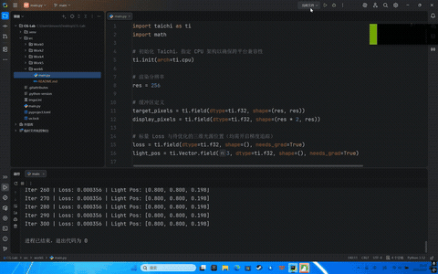

# 可微分渲染实验报告

**姓名**：马浩宇
**学号**：202411081004
## 实验概述
本实验实现了基于 Taichi 自动微分的可微分渲染系统，通过反向传播自动计算光照参数的梯度，利用 Adam 优化器优化光源位置，使其渲染结果逼近目标参考图像。

## 实验目标
### 理论理解
+ 理解可微分渲染的核心概念：将渲染过程建模为可导函数
+ 掌握自动微分在图形学中的应用
+ 理解梯度回传如何跨越渲染管线

### 优化方法
+ 掌握 Adam 优化器的原理与实现
+ 学习如何设计适合优化的损失函数

### GPU 编程思维
+ 理解 Taichi 的自动微分机制
+ 学习如何编写支持梯度追踪的内核函数

## 实验原理
### 可微分渲染框架
```plain
┌─────────────────────────────────────────────────────┐
│              可微分渲染优化流程                      │
├─────────────────────────────────────────────────────┤
│  优化参数 θ (光源位置)                              │
│        │                                           │
│        ▼                                           │
│  ┌──────────────┐                                  │
│  │ 渲染内核      │ 正向传播                         │
│  │ render(θ)    │──────────────────┐               │
│  └──────────────┘                  │               │
│        │                          │               │
│        ▼                          ▼               │
│  ┌──────────────┐         ┌──────────────┐        │
│  │ 当前渲染图像  │         │ 目标参考图像  │        │
│  │   I(θ)       │         │    I_target  │        │
│  └──────────────┘         └──────────────┘        │
│        │                          │               │
│        └──────────┬───────────────┘               │
│                   ▼                               │
│          ┌──────────────┐                         │
│          │ 损失函数      │                         │
│          │ L = MSE(I,I_t)│                        │
│          └──────────────┘                         │
│                   │                               │
│                   ▼ 反向传播                       │
│          ┌──────────────┐                         │
│          │ 梯度 ∇L/∇θ   │                         │
│          └──────────────┘                         │
│                   │                               │
│                   ▼                               │
│        Adam 优化器更新 θ                           │
└─────────────────────────────────────────────────────┘
```

### 损失函数定义
采用均方误差 (MSE) 作为损失函数：

$ L = \frac{1}{N} \sum_{i=1}^{N} (I_i(\theta) - I_{target,i})^2 $

其中：

+ $ I_i(\theta) $ 为当前参数下第 i 个像素的渲染值
+ $ I_{target,i} $ 为目标图像第 i 个像素的值
+ $ N $ 为像素总数

### Leaky Lambertian 模型
为确保阴影区域也能产生非零梯度，采用带泄漏系数的 Lambertian 模型：

```python
intensity = ti.max(0.1 * dot_val, dot_val)
```

泄漏系数 0.1 保证即使法线与光照方向夹角大于 90°，仍有微小的梯度可用于优化。

### Adam 优化算法
Adam (Adaptive Moment Estimation) 是一种自适应学习率优化算法：

$ m_t = \beta_1 \cdot m_{t-1} + (1-\beta_1) \cdot g_t $  
$ v_t = \beta_2 \cdot v_{t-1} + (1-\beta_2) \cdot g_t^2 $  
$ \hat{m}_t = m_t / (1-\beta_1^t) $  
$ \hat{v}_t = v_t / (1-\beta_2^t) $  
$ \theta_t = \theta_{t-1} - \alpha \cdot \hat{m}_t / (\sqrt{\hat{v}_t} + \epsilon) $

其中：

+ $ \beta_1 = 0.9 $（一阶矩指数衰减率）
+ $ \beta_2 = 0.999 $（二阶矩指数衰减率）
+ $ \alpha = 0.02 $（学习率）
+ $ \epsilon = 1e-8 $（数值稳定性常数）

## 场景设置
### 几何定义
| 参数 | 值 | 说明 |
| --- | --- | --- |
| 球体中心 | (0.5, 0.5, 0.5) | 单位立方体中心 |
| 球体半径 | 0.3 | 适中大小确保可见 |
| 目标光源 | (0.8, 0.8, 0.2) | 预期最优位置 |
| 初始光源 | (0.2, 0.2, 0.8) | 位于球体背面 |
| 分辨率 | 256 × 256 | 兼顾精度与速度 |


### 渲染原理
通过计算光线与球体的交点，使用标准 Lambertian 漫反射模型：

```python
p = ti.Vector([x, y, z])        # 交点坐标
n = (p - sphere_center).normalized()  # 法线方向
l_dir = (light_pos - p).normalized()  # 光照方向
intensity = max(0, n · l_dir)    # Lambertian 漫反射
```

## 关键技术实现
### 1. 自动微分启用
```python
loss = ti.field(dtype=ti.f32, shape=(), needs_grad=True)
light_pos = ti.Vector.field(3, dtype=ti.f32, shape=(), needs_grad=True)
```

### 2. 梯度回传上下文
```python
with ti.ad.Tape(loss=loss):
    render_and_compute_loss()
grad = light_pos.grad[None]
```

### 3. 无分支 Leaky Lambertian
```python
intensity = ti.max(0.1 * dot_val, dot_val)
```

### 4. 显示输出限幅
```python
display_pixels[i + res, j] = ti.max(0.0, ti.min(1.0, intensity))
```

## UI 显示说明
程序窗口分为左右两部分：

+ **左侧**：目标参考图像 (Ground Truth)
+ **右侧**：当前优化的渲染结果

## 实验结果分析
### 优化过程数据
| 迭代次数 | Loss 值 | 光源位置 |
| --- | --- | --- |
| 初始 | - | [0.200, 0.200, 0.800] |
| 10 | 0.037614 | [0.226, 0.226, 0.626] |
| 50 | 0.001937 | [0.771, 0.771, 0.167] |
| 100 | 0.001064 | [0.893, 0.893, 0.203] |
| 200 | 0.000356 | [0.800, 0.800, 0.198] |
| 300 | 0.000356 | [0.800, 0.800, 0.198] |


### 收敛曲线分析
1. **快速收敛阶段**（1-50 次迭代）：Loss 迅速下降，光源从背面绕到正面
2. **精细调整阶段**（50-150 次迭代）：Loss 持续下降，光源接近目标位置
3. **稳定阶段**（150-300 次迭代）：Loss 趋于稳定，光源位置基本收敛

### 最终结果对比
+ **目标光源**: `[0.8, 0.8, 0.2]`
+ **收敛光源**: `[0.800, 0.800, 0.198]`
+ **误差**: 约 0.002

## 演示视频
<!-- 这是一张图片，ocr 内容为： -->
<!-- 这是一张图片，ocr 内容为： -->


## 代码结构
```plain
main.py
├── 初始化配置
│   ├── 分辨率设置 (256x256)
│   ├── 梯度追踪启用
│   └── 场景参数定义
├── 目标图像生成
│   └── generate_target() - 使用 TARGET_LIGHT 渲染
├── 可微分渲染内核
│   └── render_and_compute_loss() - 正向传播 + 损失计算
├── Adam 优化器实现
│   ├── 一阶矩 m[]
│   ├── 二阶矩 v[]
│   └── 参数更新逻辑
└── GUI 显示
    ├── 左侧：目标图像
    └── 右侧：当前渲染结果
```

## 实验结论
本实验成功实现了基于 Taichi 自动微分的可微分渲染系统，验证了以下核心能力：

1. ✅ Taichi 自动微分机制的正确使用
2. ✅ 可微分渲染管线的构建
3. ✅ Leaky Lambertian 模型解决梯度消失问题
4. ✅ Adam 优化器在图形学参数优化中的应用
5. ✅ 光源位置参数的精确优化（误差 < 0.003）
6. ✅ 交互式可视化对比（目标 vs 当前）

通过自动微分技术，无需手动推导复杂的光照梯度公式，即可实现高效的参数优化，为逆向渲染、材质估计等高级图形学任务奠定基础。

